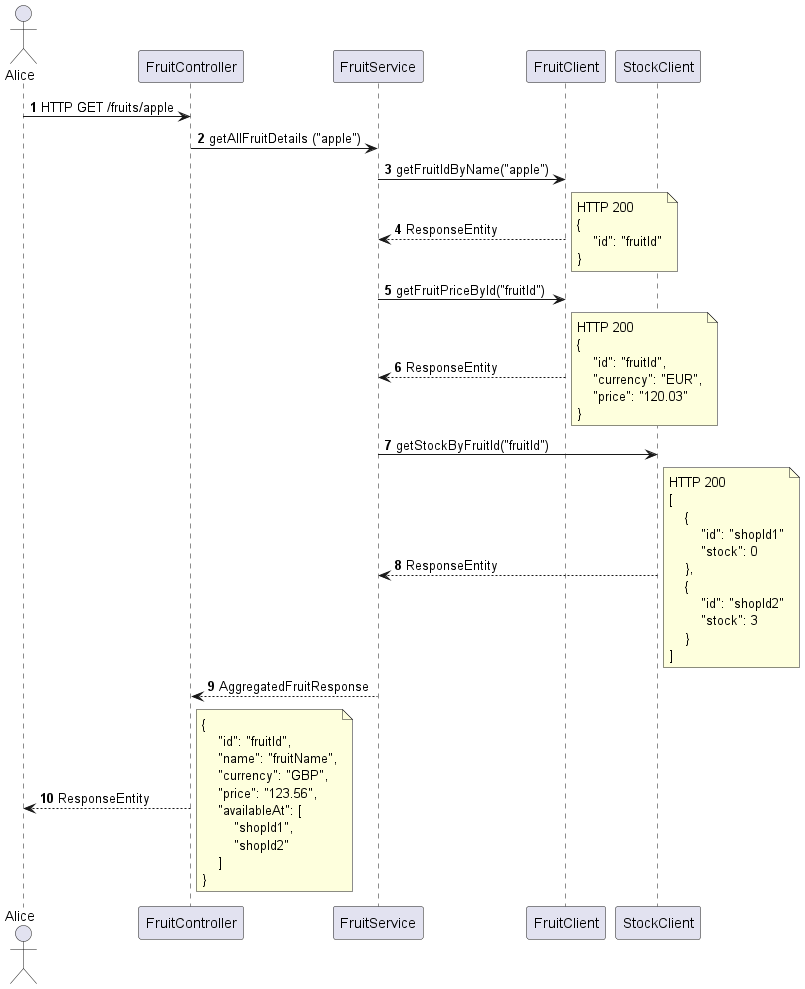

# Fruit Shop

## Description
This is a practice project to showcase skills of microservices. 
- The main component is a FruitShop where user can input a **fruit name**. 
- Base on the **fruit name** the service returns which **shopId** has the fruit on stock.
- The main Service (FruitShop) is using two mock services (FruitMockService and StockMockService).
- The deliverable product (artifact) is a **Docker image**.
- **Azure pipeline** is used to run CI/CD pipelines.

## Technologies Used
BACKEND - 
- Build with Java using Springboot and Maven
- Architecture is 3 layered.
- The communication between the components are done via HTTP.
- Docker is used to create containers.
- Azure Pipeline is used to run CI/CD pipelines for testing and deployment.

FRONTEND - 

## Installation

Prerequisites:
- Java 17
- Docker 20+

In order to run the application in local environment:
``` 
./mvnw clean package
docker compose up -d
``` 

## Data Flow


## Features
Model - View - Controller (MVC) structure to enable clean code and SOLID principles in mind. 
- **Controller** layer is responsible for handling requests facing the user. User inputs a *String fruitname* and receives in return a result aggregated from mock client services.
The layer has a *DTO object*, that includes all the necessary details required for the resposne. (id, name, currency, price, availableAt). Returns HTTP 200 with the result.
- **Service** layer is responsible for the model aggregating the responses from the *mock client services*. Currency object is designed as an *enum*. The methods reaching the client services includes *exception handling* regarding illegal arguments. *StreamAPI* is used to construct the list of shop stocks.
  - **Client** layer is responsible for the external mock services for Fruit and Stock. The DTO object includes the responses from the external services, where it returns the:
    - id based on the name, 
    - the price based on the id, 
    - the stock based on the id.
- **Persistence**
//TODO: mongoDB
- **Deployement**

**Mock Services** are used to simulate external services which only have controller layer. Because the service is depended on external services, the external services are replaced with mock implementations to be able to run tests and the service locally.
- **FruitMockService**
  - This mock service includes two response for the id (based on the name) and the price (based on the id).
  - Current implementation:
    - getFruitIdByName: generates a random ID as response given any name
    - getFruitPriceById: generates 5EUR as response given any id
- **StockMockService**
  - This mock service generate the response for the shop stock based on the fruit id
  - Current implementation:
    - getStockByFruitId: generates 5L as response given any id

**Docker** is used for containers to build, test, and deploy applications quickly.
Both the client services and the main service uses maven:3.8.7-eclipse-temurin-19 as a source image.
- The Dockerfiles
  - copy the .jar files into the image 
  - set the port to 8080
  - runs command line code

**Azure pipelile** is used to automate deployment.
- build.yaml file is based on 'ubuntu-latest' VM image
  - tasks executed in the following steps:
    - JavaToolInstaller installs JAVA 17
    - Jar file created with mnv clean install in the working directory
    - Docker image file create with tag in the working directory
    - Docker image uploaded into docker hub with the right name

## Demo
[If you have a live demo or a video showcasing your project, provide the link or embed the video here.]

## Screenshots
//TODO: add Postman screenshots
[Include screenshots or images of your project to visually represent its appearance or interface.]

## Challenges Faced
I have learnt these from this project:
//Communication between services -  FeignClient
//CI/CD flow
//Kubernetes
//MongoDB (non relational DB)

[Describe any challenges you encountered during the development process and how you overcame them. This demonstrates problem-solving skills and adaptability.]

## Future Improvements
OpenAPI document Rest endpoint
[Outline any future enhancements or additional features you plan to implement in your project.]

## Contribution Guidelines
[If your project is open-source or you want to provide instructions for future contributions, include guidelines for other developers who might want to contribute to your project.]

## Contact Information
[Provide your contact information, such as your email address or LinkedIn profile, so that potential employers can reach out to you.]

## License
[Specify the license under which your project is released. If you're not sure, you can consider using an open-source license like MIT or Apache.]

